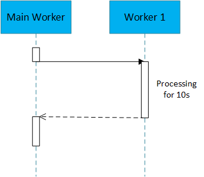
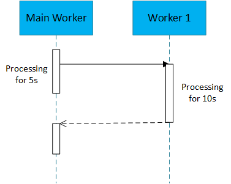
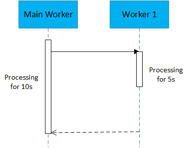
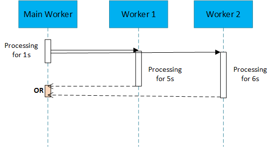
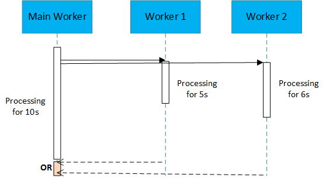

# ThreadsMEPWithRxJava

This project contains sample code snippets for implementing different message exchange patterns between threads using Rx-Java

##Pattern 1

##Pattern 2

##Pattern 3

##Pattern 4 

##Pattern 5

##Pattern 6
 
